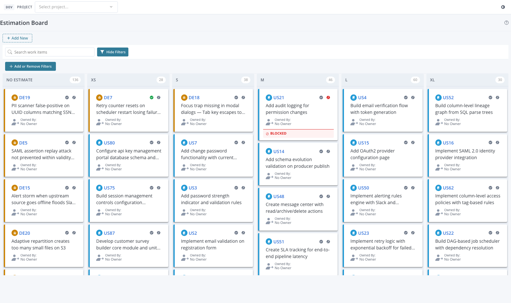

# Estimation Board

A Rally Custom View widget that lets teams **size work by dragging cards** between estimate columns. Stories, defects, and defect suites are grouped by their `PlanEstimate` value; dropping a card onto a different column updates Rally in place.



---

## Features

- **Drag-and-drop estimation** — move cards between size columns to set `PlanEstimate`. Updates persist to Rally on drop.
- **Configurable columns** — define your own size scale (defaults to No Estimate / XS / S / M / L / XL with point values 1, 2, 3, 5, 8). Each column has a label and a numeric value.
- **Multiple artifact types** — show user stories, defects, and defect suites side by side; toggle each type on or off.
- **Ready / Blocked toggles** — flip status flags inline on each card without opening the artifact.
- **Add new** — create a new story / defect / defect suite directly from the board, scoped to the current project.
- **Filter bar** — search by name or formatted ID, filter by type or owner. Multiselect chips reflect what's actually present in the current scope.
- **Optional swim lanes** — group rows by any field on the artifact (Owner, Project, custom field, etc.).
- **Custom WSAPI filter** — narrow the board with arbitrary Rally query syntax, e.g. `(Iteration.Name = "Sprint 12")`.

---

## Setup

For end-to-end setup — Rally API key, auth configuration, dev harness, and deployment — see **[docs/setup-guide.md](docs/setup-guide.md)**.

Quick start once auth is configured:

```bash
npm install
npm run dev          # Dev server (mock data) at http://localhost:5847
npm run build        # Production IIFE bundle (live Rally data)
npm run build:mock   # Mock bundle (no Rally credentials needed)
npm run typecheck    # TypeScript check
npx widget-ai deploy # Build + deploy to Rally as a Custom View
```

---

## Settings

| Setting | Default | Description |
|---------|---------|-------------|
| Columns | No Estimate, XS (1), S (2), M (3), L (5), XL (8) | Editable list of column label + point value pairs |
| Artifact Types | Story, Defect, Defect Suite | Toggle each type on or off |
| Additional Filter | (none) | Extra WSAPI query, e.g. `(Owner.UserName = "jsmith")` |

Settings are configured in Rally's Edit Mode (gear icon on the Custom View) and persist per widget instance.

---

## Source

- `src/App.tsx` — Main widget component (CardBoard + filter bar + EditMode panel)
- `src/types.ts` — `EstimationBoardItem`, `EstimationBoardDataProvider`, `EstimationBoardSettings`, `EstimationSize`
- `src/data-provider.ts` — Live Rally WSAPI provider (queries multiple artifact types in parallel)
- `src/hooks/useEstimationBoardData.ts` — Data fetching hook
- `src/components/SizesEditor.tsx` — Inline editor for the column scale
- `src/main.tsx` — Entry point, mock/live branching

---

## Reference

- **[Setup guide](docs/setup-guide.md)** — Rally auth, dev harness, deploy
- **[API reference](docs/api-reference.md)** — `@customagile/widget-ai` components and hooks
- **[Cookbook](docs/cookbook.md)** — common patterns
- **[Getting started](docs/getting-started.md)** — quick orientation for new developers
